<div align="center">
  
</div>

<div align="center">
  
</div>

<div align="center">
  
  
  
  
</div>

<br/>

<div align="center">
  <br>
</div>

---

## 🚀 About Me


```typescript
const henokh: Developer = {
    name: "Henokh Iglessias Hutasoit",
    location: "Batam, Indonesia 🇮🇩",
    code: ["JavaScript", "Python", "SQL", "PHP"],
    askMeAbout: ["Web Dev", "AI", "Chatbots", "Tech Innovation"],
    technologies: {
        frontend: {
            js: ["React", "Next.js"],
            css: ["TailwindCSS", "Bootstrap", "Styled Components"],
        },
        backend: {
            js: ["Node.js", "Express.js"],
            php: ["Laravel"],
            python: ["Flask"],
            api: ["RESTful", "GraphQL"]
        },
        database: ["MySQL", "PostgreSQL"],
        ai_ml: ["TensorFlow", "PyTorch", "Scikit-learn", "OpenAI API", "Ollama"],
        devOps: [ "Git", "Linux", "AWS"],
        tools: ["VS Code", "Postman", "Figma", "Notion"]
    },
    currentProject: "Building intelligent AI chatbots with Deepseek model",
    currentlyLearning: "Advanced Machine Learning & Cloud Architecture",
    lookingFor: "Collaboration on innovative AI projects",
    funFact: "I debug with console.log and I'm proud of it! 😄"
};
```

---

## 🛠️ Tech & Skills

<div align="center">

### 💻 Frontend Development
<p>

</p>

### ⚙️ Backend Development  
<p>

</p>

### 🗄️ Database & Cloud
<p>

</p>

### 🤖 AI & Machine Learning
<p>

</p>

### 🛠️ Development Tools
<p>

</p>

</div>

---

## 📊 GitHub Analytics

<div align="center">
<table>
<tr>
<td width="50%">


</td>
<td width="50%">


</td>
</tr>
</table>
</div>

<div align="center">
  
</div>

<div align="center">
  
</div>

---

## 🚀 Featured Projects

<div align="center">

<table>
<tr>
<td width="50%">
<h3 align="center">🤖 PolCaBot - AI Chatbot Academy</h3>
<div align="center">  
<a href="#" target="_blank"></a>  
<a href="#" target="_blank"></a>  
<a href="#" target="_blank"></a>  
</div>
<p align="center">
Polibatam academy chatbot leveraging Deepseek model for intelligent academic support and student engagement.
</p>
<p align="center">
<a href="#" target="_blank">

</a>  
<a href="#" target="_blank">

</a>
</p>
</td>
<td width="50%">
<h3 align="center">🅿️ Smart Parking System</h3>
<div align="center">  
<a href="#" target="_blank"></a>  
<a href="#" target="_blank"></a>  
<a href="#" target="_blank"></a>  
</div>
<p align="center">
Community-driven reporting platform for urban management in Batam with real-time geolocation services.
</p>
<p align="center">
<a href="https://github.com/iglessias/parking-system" target="_blank">

</a>  
<a href="#" target="_blank">

</a>
</p>
</td>
</tr>
</table>

</div>

---

## 🏆 GitHub Trophies

<div align="center">
  
</div>

---

## 📈 Contribution Activity

<div align="center">
  
</div>

<div align="center">
  
</div>

---

## 🐍 GitHub Contributions

<div align="center">
  
</div>

---

## 🌐 Connect & Collaborate

<div align="center">

### 📱 Let's connect and build something amazing together!

[](https://www.linkedin.com/in/henokh-iglessias-hutasoit-9a071527a/)
[](mailto:henokh.08hts@gmail.com)
[](#)
[](#)

### 💬 Ask me about anything related to:
**Web Development** • **AI** • **Chatbot Development** • **Open Source** • **Tech Innovation**

</div>

---

<div align="center">
  
### 🎯 Current Goals for 2025

```mermaid
graph LR
    A[🚀 Launch AI Projects] --> B[🌟 Contribute to Open Source]
    B --> C[📚 Master Cloud Architecture]
    C --> D[🤖 Build Advanced ML Models]
    D --> E[🌍 Impact Communities]
```



</div>

---

## 📊 Weekly Development Breakdown

```text
JavaScript   12 hrs 30 mins  ████████████████████░  80.5%
Python       2 hrs 15 mins   ██████░░░░░░░░░░░░░░░  14.5%
CSS          45 mins         ██░░░░░░░░░░░░░░░░░░░   4.8%
Other        5 mins          ░░░░░░░░░░░░░░░░░░░░░   0.2%
```

---

<div align="center">
  
</div>

<div align="center">
  <h3>💭 Quote of the Day</h3>
  
</div>

<div align="center">
  <h3>⚡ Fun Fact</h3>
  <p><i>"The best code is written when fueled by coffee and curiosity! ☕️✨"</i></p>
  
  <br>
  
  
  
  
  
  <br><br>
  
  <p><strong>⭐ From <a href="https://github.com/iglessias">Henokh Iglessias</a> with ❤️</strong></p>
  
  <div align="center">
    <sub><i>Last updated: August 2025 🗓️</i></sub>
  </div>
</div>
